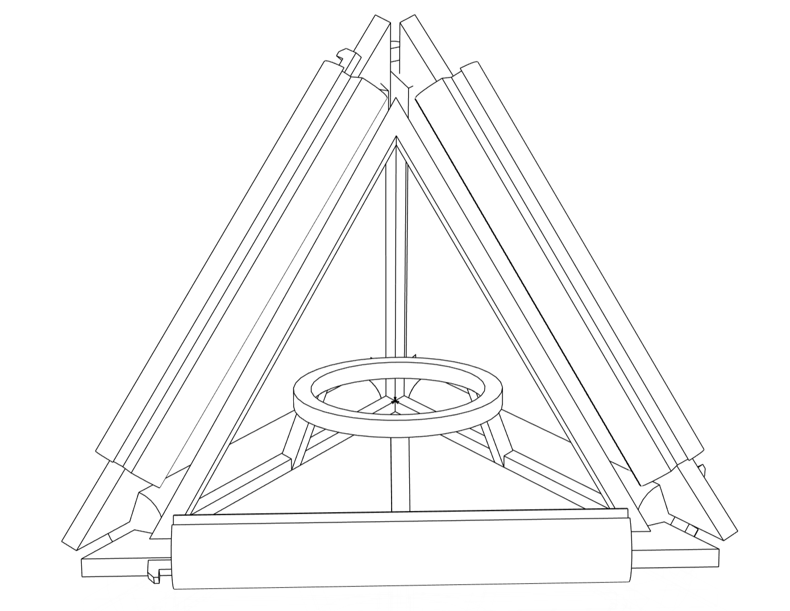

# Student Tetrahedron
**An open-ended smart status indicator for more aware, responsive classrooms.**   
*Designed with* 🔥 *and* ❤️ *by Bas Baccarne*   

Managing medium to large classrooms can be hard. Students progress at different speeds, have different support needs, and communicate differently. Some ask for help immediately, others sit quietly for far too long.
The **Student Tetrahedron** is a physical status indicator that sits on each student's desk. Instead of keeping an arm raised for twenty minutes, students simply rotate their tetrahedron to signal their current state. At a glance, a teacher can read the color patterns across the room and immediately understand where the class stands. Who's stuck, who's done, who needs a nudge?   

The system is designed to be **modular and adaptable**. With only four sides, the cognitive load stays low. Each face can be customized to match the specific needs, language, and sensitivities of a course or context.

## CAD-model & production
The tetrahedron uses 4 triagular faces that you can produce yourself. Use translucent acryl, 3D print them, or use wooden fineer. The faces are held together by ribs and corner pieces.
* Option1 = magnet snaps
* Option2 = snap fit

The electronics are housed in a smaller triagular structure that fits inside the tetrahedron. Through a magnet snap on one of the ribs, the tetrahedron can be charged. 

My laser cut settings:
| material| thickness|power|speed |comment |
|--- |---|---|---|---|
| acryl transparent | 2.4mm | 50% | 0.3% | with foil (just a bit too little) |

## Electronics
| Type  | part  | remark |
|---|---|---|
| microcontroller |  ATtiny1614 | has I2C, small, low power |
| orientation sensor | MPU-6050 / LSM6DSOXTR / Adafruit MPU-6050 | 6-axis IMU, can detect orientation |
| LiPo charger | TP4056 / 426-DFR0668 | 1A charging, widely available |
| voltage regulator | XC6206 3.3V LDO (XC6206P332MR-G) | 3.3V output, low dropout |
| battery | 500mAh LiPo | small, rechargeable |
| switch | slide switch | for power control |
| pogo magnet snap | 303D-L186M020, 686C02222030C1E/686A03222001D1E or DIY | for connecting to the charging board |
| LED | EDISON filament led or NeoPixel Stick or NeoPixel Mini PCB | addressable LEDs for customizable patterns |

## Considerations
* keep orientation sensor away from lipo and magnets
* check influence of marget snap on orientation sensor
* Add programming pins to the pcb

## tests
* [Arduino Nano 33IOT orientation test](/tests/orientation/orientation__33.ino)

## License
This repository contains both software and design materials created as part of an industrial design energineering project at Ghent University.
- **Software and code:** [MIT License](./LICENSE-MIT)  
- **Design, documentation, CAD, and media:** [CC BY 4.0 License](./LICENSE)

You are free to reuse and build upon this work, both commercially and non-commercially, as long as proper attribution is given to the original authors.

